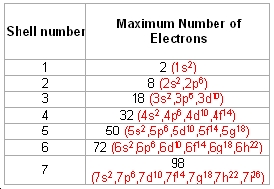

# Section A

## Chapter 1

* **Sublimation** - Where a substance goes directly between solid and gas rather than to liquid at any point (e.g. *carbon dioxide*)

* **Diffusion** - The spreading out of gas or liquid particles

Lighter particles in a gas travel much faster than heavier ones.

## Chapter 2

* **atomic number** = number of protons
* **mass number** = number of protons + neutrons
* **Isotopes** are elements with the same number of protons but with a different amount of neutron
* number of electrons = number of neutrons

### Arrangement of the electrons

* The electrons are found at considerable distances from the nucleus in a series of levels called **energy levels** or **shells**

* Each level can only hold a certain amount of electrons.

* The formula for maximum amount of electrons per shell is **2n2**.

* Lower levels are always filled before the higher ones

#### How to work out the arrangement of electrons

* Find out the number of protons for the atom
* Assume the same amount of neutrons as neutrons for a neutral atom
* Arrange the electrons in layers, slowly filling them up

## Chapter 3

### Covalent Bonds

A covalent bond is where two atoms share a pair of electrons.

### Ionic (electrovalent) Bonds

An ionic bond is where two atoms share a single electron, and one of the atoms pulls the electron very close to itself, and becomes negatively charged. The atom loosing the electron becomes positively charged.

* A positive ion is called a **cation**.
* A negative ion is called an **anion**.

### Metallic Bonds

In a metallic bond, neutral metallic atoms lose their negatively-charged electrons into the surrondings, and thusly become postitvely charged.

## Chapter 4

There are two types of strutures, **giant** and **molecular**.

### Giant metallic structures

* **Giant metallic structures** consist of a regular array of posititve ions in a sea of delocalised electrons.

Metals are generally good conductors of heat and electricity. They also typically have a maliable structure.

If a small force is exerted onto a metal, some of the particles move into their new positions.

#### Alloys

An alloy is a mixture of metals; a metallic compound.

* **Brass** is a mixture of copper and zinc.

### Giant ionic structures

*Ionic compounds have high melting points and boiling points because of strong intermolecular forces holding the lattices together.*

All ionic compounds consist of huge lattices of positive and negative ions packaged together, held together by the strong attractions between the positively and negatively charged ions.

* sodium chloride, magnesium oxide

They tend to be **crystalline** and **brittle**. This is because small distortions will bring ions with the same charge alongside each other, like charges repel and so the crystal splits itself apart.

#### Polar Molecules

Water, for instace, has a slight negative charge on it's oxygen atom, and a slight positive charge on both of the hydrogen atoms (due to them loosing an electron).

For instance, with sodium chloride and water, the sligtly positive hydrogens in the water cluster around the negative ions, and the slightly negative oxygens are attracted to the positive ions.

### Giant covalent structures

Giant covalent structures tend to have very high melting and boiling point, and generally are insoluble in any solvents.

### Simple molecular structures

They tend to be insoluble in water, unless they react with it.

## Chapter 5

### Ions that need to be learned

<table>
	<tr>
		<td>Charge</td>
		<td>Substance</td>
		<td>Ion</td>
	</tr>
	<tr>
		<td>Positive</td>
		<td>zinc</td>
		<td>Zn2+</td>
	</tr>
	<tr>
		<td></td>
		<td>silver</td>
		<td>Ag+</td>
	</tr>
	<tr>
		<td></td>
		<td>hydrogen</td>
		<td>H+</td>
	</tr>
	<tr>
		<td></td>
		<td>ammonium</td>
		<td>NH4+</td>
	</tr>
	<tr>
		<td>Negative</td>
		<td>nitrate</td>
		<td>NO3-</td>
	</tr>
	<tr>
		<td></td>
		<td>hydroxide</td>
		<td>OH-</td>
	</tr>
	<tr>
		<td></td>
		<td>hydrogencarbonate</td>
		<td>HCO3-</td>
	</tr>
	<tr>
		<td></td>
		<td>carbonate</td>
		<td>CO32-</td>
	</tr>
	<tr>
		<td></td>
		<td>sulfate</td>
		<td>SO42-</td>
	</tr>
</table>

### Charges on ions

| Element in Periodic Table Group | Charge on ion |
| ------------------------------- | ------------- |
| 1 | +1 |
| 2 | +2 |
| 3 | +3 |
| 5 | -3 |
| 6 | -2 |
| 7 | -1 |

### Endings

* sulf**ide** - A name like *copper sulfide* means there is just copper and sulfur only.
* sulf**ate** - A name like *copper sulfate** means there is something there as well - often, but not always, oxygen.

#### Formula for *sodium oxide*

* Sodium is in group 1, so the ion is **Na+**.
* Oxygen is in group 6, so the ion is **O2-**.
* To have equal numbers of positive and negative charges, you would need two sodium ions to provide the two positive charges to cancel the two negative charges on one oxide ion. In other words you need:
* **Na+**
* **Na+**
* **O2-**

#### Formula for *barium nitrate*

* Barium is in group 2, so the ion is **Ba2+**.
* Nitrate ions are **NO3-**. You will have to remember this.
* Thus, to have equal numbers of positive and negative charges, you would need two nitrate ions for each barium ion.
* The formula is **Ba(NO3)2**
